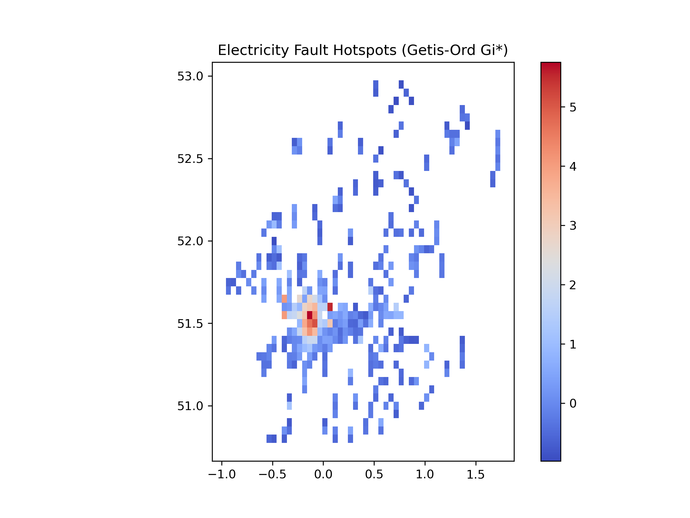

  

# Electricity Distribution Network Fault Analysis and Prediction

## Overview
This project analyzes electricity distribution network faults using both **spatial** and **temporal** data analysis techniques. The main objectives are to:  
- Identify fault hotspots geographically  
- Analyze temporal patterns and trends of faults  
- Forecast potential future faults using time-series models  

## Dataset
The analysis uses the **UK Power Networks IIS dataset**, which contains **237,901 fault records** with:  
- Geographic coordinates (latitude, longitude)  
- Timestamps of faults  
- Fault causes and types  

## Methodology
The project follows a structured workflow:  

1. **Data Preprocessing and Cleaning**  
   - Handling missing values  
   - Correcting data types and formats  

2. **Exploratory Data Analysis (EDA)**  
   - Descriptive statistics  
   - Visualization of fault trends over time and by location  

3. **Spatial Analysis**  
   - Hotspot detection using **Getis-Ord Gi\*** to identify areas with concentrated faults  

4. **Temporal Analysis and Forecasting**  
   - Time-series modeling using **ARIMA** to predict future fault counts  

## Tools and Libraries
- Python  
- Pandas  
- GeoPandas  
- Matplotlib & Seaborn  
- Statsmodels  

## Project Structure

data/
    ukpn-iis.csv                # Raw dataset

notebooks/
    fault_analysis.ipynb        # Jupyter notebook with analysis workflow

results/
    cleaned_fault_data.csv      # Cleaned dataset
    forecast_results.csv        # ARIMA forecast outputs
    hotspot_results.csv         # Spatial hotspot outputs
    figures/                    # Plots and visualizations

## Key Outputs

* **Spatial Hotspots:** Identification of areas with high fault density
* **Temporal Trends:** Insights into monthly and yearly fault patterns
* **Forecasting:** ARIMA-based predictions for future faults
* **Visualizations:** Maps, charts, and plots illustrating key findings

## Visualizations

**1. Spatial Hotspot Map**


**2. ARIMA Forecast Plot**


## Installation

To run the analysis locally:

1. Clone this repository:

   ```bash
   git clone https://github.com/DilaknaH/Electricity-Fault-Analysis.git
   ```
2. Install dependencies (Python 3.10+ recommended):

   ```bash
   pip install -r requirements.txt
   ```
3. Open `notebooks/fault_analysis.ipynb` in Jupyter Notebook or VS Code

## Usage

* Follow the notebook to explore **data cleaning, EDA, spatial analysis, and forecasting**
* Results and figures will be saved in the `results/` folder

## License

This project is licensed under the [MIT License](LICENSE).

## Author

**Dilakna Godagamage** – Data Science Undergraduate 
